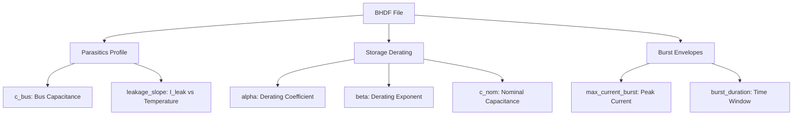

# BHDF Schema Specification
## Battery-Free Hardware Description File Format

> **ECTC Paper Reference**: Section V-C - FEMP 2.0 Methodology  
> **Version**: 1.0  
> **Status**: Stable

## Overview

The **BHDF (Battery-Free Hardware Description File)** is a JSON-based format that captures the essential hardware parameters for ECTC battery-free energy management. This schema enables accurate energy modeling by including parasitic parameters that are often ignored in traditional models.

> [!IMPORTANT]
> Ignoring the `c_bus` parameter leads to **4.6× energy estimation error** according to ECTC paper measurements.

---

## Schema Structure

The BHDF consists of three core sections:



---

## 1. Parasitics Profile

Captures chip-level parasitic parameters critical for accurate energy modeling.

| Field | Type | Unit | Description |
|-------|------|------|-------------|
| `c_bus` | float | pF | **Core finding**: Bus equivalent capacitance. Contributes to dynamic power via `P = α·C_bus·V²·f` |
| `leakage_slope` | float | nA/°C | Leakage current variation with temperature for online drift compensation |
| `leakage_reference` | float | nA | Leakage current at reference temperature |
| `reference_temp` | float | °C | Reference temperature for leakage measurement |

### Physics Background

The parasitic bus capacitance contributes additional energy consumption:

```
E_parasitic = N_switches × (1/2) × C_bus × V_dd²
```

Where:
- `N_switches` = Number of bus transitions during task
- `C_bus` = Bus parasitic capacitance (pF)
- `V_dd` = Supply voltage (V)

---

## 2. Storage Derating

Models the non-ideal behavior of supercapacitors under varying voltage conditions.

| Field | Type | Unit | Description |
|-------|------|------|-------------|
| `c_nom` | float | µF | Nominal capacitance value from datasheet |
| `alpha` | float | - | Derating coefficient (typically 0.1-0.3) |
| `beta` | float | - | Derating exponent (typically 1.5-2.5) |
| `v_rated` | float | V | Rated voltage of the storage capacitor |

### Derating Formula (Eq 2 from Paper)

The effective capacitance varies with voltage:

```
C_eff(v) = C_nom × (1 - α × (v / V_rated))^β
```

**Interpretation**:
- At full voltage: Capacitance is reduced by derating effects
- At lower voltages: More usable capacitance available
- This is critical for accurate energy budget calculations

### Example Calculation

For a 100µF capacitor with `α=0.15`, `β=2.0`, `V_rated=3.3V`:
- At V=3.3V: `C_eff = 100 × (1 - 0.15×1.0)² = 72.25 µF`
- At V=2.5V: `C_eff = 100 × (1 - 0.15×0.76)² = 88.5 µF`

---

## 3. Burst Envelopes

Defines current constraints to prevent brownout during high-power operations.

| Field | Type | Unit | Description |
|-------|------|------|-------------|
| `max_current_burst` | float | mA | Maximum instantaneous current during task execution |
| `burst_duration_max` | float | ms | Maximum duration of current burst |
| `brownout_threshold` | float | V | Voltage below which brownout occurs |

### Brownout Prevention

The burst envelope ensures:
```
I_burst × T_burst ≤ C_eff × ΔV_safe
```

Where `ΔV_safe = V_current - V_brownout`

---

## Complete JSON Schema

```json
{
  "$schema": "http://json-schema.org/draft-07/schema#",
  "title": "ECTC BHDF Schema",
  "type": "object",
  "required": ["metadata", "parasitics_profile", "storage_derating", "burst_envelopes"],
  "properties": {
    "metadata": {
      "type": "object",
      "properties": {
        "version": {"type": "string"},
        "mcu_family": {"type": "string"},
        "created_date": {"type": "string", "format": "date-time"},
        "tool_version": {"type": "string"}
      }
    },
    "parasitics_profile": {
      "type": "object",
      "required": ["c_bus"],
      "properties": {
        "c_bus": {"type": "number", "description": "Bus capacitance in pF"},
        "leakage_slope": {"type": "number", "description": "nA per °C"},
        "leakage_reference": {"type": "number", "description": "nA at reference temp"},
        "reference_temp": {"type": "number", "description": "°C"}
      }
    },
    "storage_derating": {
      "type": "object",
      "required": ["c_nom", "alpha", "beta", "v_rated"],
      "properties": {
        "c_nom": {"type": "number", "description": "Nominal capacitance in µF"},
        "alpha": {"type": "number", "description": "Derating coefficient"},
        "beta": {"type": "number", "description": "Derating exponent"},
        "v_rated": {"type": "number", "description": "Rated voltage in V"}
      }
    },
    "burst_envelopes": {
      "type": "object",
      "required": ["max_current_burst"],
      "properties": {
        "max_current_burst": {"type": "number", "description": "Peak current in mA"},
        "burst_duration_max": {"type": "number", "description": "Max burst duration in ms"},
        "brownout_threshold": {"type": "number", "description": "Brownout voltage in V"}
      }
    }
  }
}
```

---

## Example BHDF File

### CC2650 + 100µF Supercap Configuration

```json
{
  "metadata": {
    "version": "1.0",
    "mcu_family": "CC2650",
    "created_date": "2024-06-15T00:00:00Z",
    "tool_version": "ECTC-FEMP-2.0",
    "notes": "Extracted using fallback_cbus_identification.py"
  },
  "parasitics_profile": {
    "c_bus": 12.3,
    "c_bus_unit": "pF",
    "leakage_slope": 0.4,
    "leakage_slope_unit": "nA/°C",
    "leakage_reference": 12.5,
    "leakage_reference_unit": "nA",
    "reference_temp": 25.0,
    "reference_temp_unit": "°C",
    "extraction_method": "differential_measurement"
  },
  "storage_derating": {
    "c_nom": 100.0,
    "c_nom_unit": "µF",
    "alpha": 0.15,
    "beta": 2.0,
    "v_rated": 3.3,
    "v_rated_unit": "V",
    "capacitor_type": "MLCC Supercap",
    "manufacturer": "Murata"
  },
  "burst_envelopes": {
    "max_current_burst": 25.0,
    "max_current_burst_unit": "mA",
    "burst_duration_max": 5.0,
    "burst_duration_max_unit": "ms",
    "brownout_threshold": 1.8,
    "brownout_threshold_unit": "V",
    "safety_margin": 0.1
  }
}
```

### STM32U575 Configuration

```json
{
  "metadata": {
    "version": "1.0",
    "mcu_family": "STM32U575",
    "created_date": "2024-06-15T00:00:00Z",
    "tool_version": "ECTC-FEMP-2.0"
  },
  "parasitics_profile": {
    "c_bus": 20.0,
    "c_bus_unit": "pF",
    "leakage_slope": 0.6,
    "leakage_slope_unit": "nA/°C",
    "leakage_reference": 150.0,
    "leakage_reference_unit": "nA",
    "reference_temp": 25.0,
    "reference_temp_unit": "°C"
  },
  "storage_derating": {
    "c_nom": 100.0,
    "c_nom_unit": "µF",
    "alpha": 0.12,
    "beta": 1.8,
    "v_rated": 3.6,
    "v_rated_unit": "V"
  },
  "burst_envelopes": {
    "max_current_burst": 35.0,
    "max_current_burst_unit": "mA",
    "burst_duration_max": 3.0,
    "burst_duration_max_unit": "ms",
    "brownout_threshold": 1.71,
    "brownout_threshold_unit": "V"
  }
}
```

---

## Usage in ECTC

### Loading BHDF in Python

```python
import json
from simulation.energy_model import FEMPParameters, FEMPEnergyModel

def load_bhdf(filepath: str) -> FEMPParameters:
    """Load BHDF and create FEMP parameters."""
    with open(filepath) as f:
        bhdf = json.load(f)
    
    pp = bhdf['parasitics_profile']
    sd = bhdf['storage_derating']
    
    return FEMPParameters(
        C_bus=pp['c_bus'] * 1e-12,  # pF to F
        I_leak=pp['leakage_reference'] * 1e-9,  # nA to A
        C_cap=sd['c_nom'] * 1e-6,  # µF to F
        V_max=sd['v_rated']
    )
```

### Validating BHDF Files

```bash
# Use the schema to validate a BHDF file
python -c "
import json
bhdf = json.load(open('my_device.bhdf.json'))
assert 'parasitics_profile' in bhdf
assert 'c_bus' in bhdf['parasitics_profile']
print('BHDF validation passed!')
"
```

---

## Tools for BHDF Generation

| Tool | Purpose |
|------|---------|
| [fallback_cbus_identification.py](file:///tools/fallback_cbus_identification.py) | Extract `c_bus` and `leakage` from measurements (No EDA required) |
| FEMP Platform | Direct hardware measurement for parameter extraction |
| SPICE Simulation | Pre-silicon parasitic estimation |

---

## References

- ECTC Paper Section V-C.1: Differential C_bus extraction
- ECTC Paper Equation 2: Capacitor derating formula
- ECTC Paper Equation 10: Leakage current calculation
- ECTC Paper Table II: Reference hardware parameters
